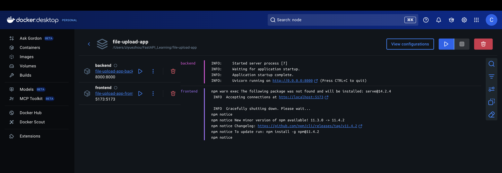

# Learning Dockerize the File Upload App using `docker init`

## For this practice, which is a multi-service application which has frontend and backend

Once we have initialized the Dockerfile and docker-compose.yaml in ./backend and ./file-uploads-front, to build and run the application
using 1 image, we need to create a root-level `docker-compose.yaml` file.
- this combines both services into a root-level compose.yaml file

```plaintext
file-upload-app/
├── backend/
│   ├── Dockerfile
│   ├── ...
├── file-uploads-front/
│   ├── Dockerfile
│   ├── ...
├── compose.yaml      # <---- COMBINED HERE
└── README.md
```


## Here is the original compose.yaml file for ./backend

```yaml
services:
  server:
    build:
      context: .
    ports:
      - 8000:8000
```

## Here is the original compose.yaml file for ./file-uploads-front

```yaml
services:
  server:
    build:
      context: .
    environment:
      NODE_ENV: production
    ports:
      - 5173:5173
```


* Once you have the root-level `docker-compose.yaml` file, you can run the application using `docker compose up --build`.

This will:
	•	Build images for both backend and frontend
	•	Start both containers

## Here is the image of docker container when you run `docker compose up --build`


**As you can see both the frontend and backend services are running in a single container.**

### Rebuild the image if you change the Dockerfile or the root-level compose.yaml

```bash
docker compose up --build
```

This will rebuild the image and start the container.

## `docker compose watch`
docker compose watch — Hot Reload for Docker Compose

You specify which files/folders to watch for each services in the compose.yaml file to be watched.
when the specified files/folders changes, docker compose will rebuild the affected images and restart the containers
